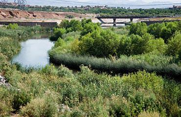
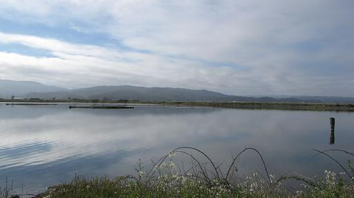
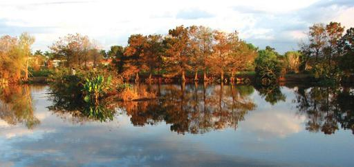
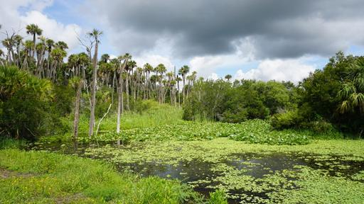
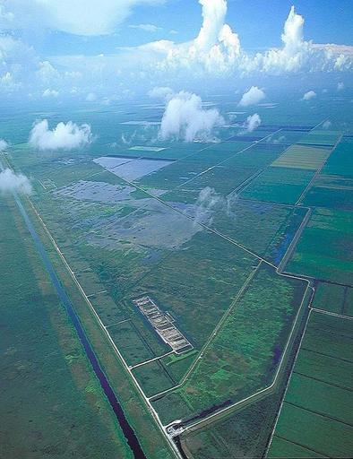
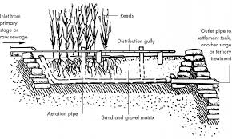

# Constructed Wetlands in Little Rock

## What Are Constructed Wetlands?

Wetlands are environments characterized by inundation of water, and where these environments are man-made, they are typically referred to as constructed wetlands. Wetlands are constituted of anything from heavily forested swamps, tidal marshes near oceans, and seasonal vernal pools of the midwest. Constructed wetlands might include anything from rock reed filters which cover only a few square feet to the massive storm treatment areas of the everglades which cover thousands of acres.

## What are the Applications of a Constructed Wetland?

Counties and municipalities construct wetlands for a variety of reasons; however, the motivations to construct these projects usually fall within one or more of three categories:

- Environmental restoration
- Agricultural or urban runoff treatment
- Low-maintenance waste water treatment

*Restoration:*

Arkansas, specifically, has had an estimated 90% reduction in wetland area since its settlement. While much of this area is near the Delta region, wetland habitat within the City of Little Rock has also diminished over the course of its development. Florida, with its massive everglades region, has perhaps the most well recognized commitment to protecting and expanding wetlands through construction and restoration.

Many plant and animal species can only survive in these environments, and the value of wetlands as habitat speaks for itself.

*Runoff Treatment:*

Wetlands act like a natural filter for moving water. The reduced velocity of water through a densely vegetated wetland, as opposed to narrow channels, allows solids like sediment to settle. Turbidity within water can be a natural phenomenon; however, many species of aquatic plants and animals cannot survive in the presence of excessive turbidity. Where there are large amounts of land alteration activity upstream, and by extension increased erosion and sediment loss, turbidity typically increases within downstream water bodies. In the absence of water features within the flow path like lakes or ponds which slow the flow of water, fine particulate matter like clays and silts may be carried many miles from their origin.

Agricultural areas regularly introduce nitrates and phosphates as fertilizers, which then are carried in surface water runoff to downstream water bodies. Wetland vegetation is well suited to sequestering these excess nutrient loadings. While necessary for aquatic life, nitrates and phosphates in high concentration will result in algal blooms and a reduction in available oxygen.

*Waste Water Treatment:*

Usage of wetlands as a water treatment stage is more recent than conventional water treatment techniques developed in the mid-nineteenth century; however, they have demonstrable advantages over conventional techniques alone. In brief, conventional water treatment occurs in two stages. In the first stage, large solids are screened, and smaller solids are extracted by gravity separation in settlement tanks. The secondary stage involves digestion of organic matter with bacteria, usually in the presence of an aeration process, which is separated in another settlement tank. Effluent from the final settlement tank is typically disinfected with chlorine or ultraviolet light and discharged into receiving waters.

Wetlands are not able to replace water treatment facilities for metropolitan areas; however, they are a capable of adding value as a tertiary treatment stage. Of particular note, wetlands with sufficient hydraulic retention time are actually able to reduce the loadings of substances not easily removed from water by conventional treatment processes. Pharmaceuticals for instance, are not often consumed or neutralized in the secondary treatment phase of conventional water treatment; however, these substances will settle in wetlands given sufficient time.

## Examples

Multiple man-made wetlands exist across the United States. Some are popular tourist destinations, and a few of the constructed wetlands in the list below should be familiar.

### Las Vegas, NV

Figure 1. The Wash leading to Lake Meade

- 12 mile channel
- 200MGD throughput
- Provides habitat
- "Polishes" urban runoff
- Takes treated sewage, urban runoff and ground water

### Arcata, CA

Figure 2. Arcata Wetland

- 300 acres
- 2MGD of treated sewage
- 327 recorded species of birds
- Constructed in 1986

### Palm Beach County, FL

Figure 3. Wakodahatchee

- 50 acres
- 0.75MGD of treated sewage
- 178 Bird Species
- Used to recharge ground water

## Orlando, FL

Figure 4. Orlando Easterly Wetlands

- 1200 acres
- 35MGD received from 17 mile pipeline
- 20-40 day hydraulic retention time
- 50% Nitrogen, 70% Phosphate reduction
- 1,000+ tours annually
- Built in 1985
- Cost $4.95M for construction and planting ($14.5M today)

### Everglades, FL

{height=512px}

Figure 5. The Everglades Storm Treatment Area

- 57,000 acres of Stormwater Treatment Areas (STA)
- appx 1.3B gal/day
- Treatment of agricultural runoff
- 10-20 day hydraulic retention time
- 70-80% phosphate reduction
- STAs also used for recreation and game

### Arkansas

{width=200px}

Figure 6. Rock reed filter diagram

There are many locations where rock reed filters have been installed as a  sewage treatment method, typically for septic effluent, in rural communities in Arkansas. These installations are usually much smaller than some of the more well known wetland projects, but they are still local examples of the viability of applying constructed wetlands to water quality problems. Some of these locations include:

- Bradford
- Bradley
- Carlyle
- Clarendon
- Corning
- Derricks
- Emerson
- Eudora
- Gilette
- Gould
- Horseshoe Lake
- Imboden
- Judsonia
- Lewisville
- Lockesberg
- Marion
- Mitchellville
- Ola
- Prescott
- Rector
- Thorton
- Tuckerman

Constructed wetlands are not a theoretical or untested method for treatment of urban runoff or sewage treatment. Constructed wetland projects within Arkansas have been completed as recently as last year, and wetlands like the Orlando Easterly Wetlands have been adding value to their communities for over thirty years.

## The Opportunity

Two of Little Rock's publicly owned golf courses, Hindman and War Memorial, have received particular attention for "repurposing." While those specific purposes have not been publicly announced, there are distinct advantages to using these areas for wetlands as opposed to some other recently suggested land uses.

*Water Quality:*

The receiving waters of Fourche Creek have been identified as impaired by the Arkansas Department of Environmental Quality. Conversion to commercial and residential usage of Hindman Park or War Memorial will unavoidably increase that level of impairment. Both parks are well located to provide treatment for urban runoff to improve the quality of water entering into Fourche Creek.

Constructed wetlands can support treatment of approximately 0.5 gallons of water per square foot. While a "rule of thumb," this number does translate well to the realized quantities shown in the examples from the previous section. If either Hindman or War Memorial were to be converted to wetland, the following water treatment capacities might be expected.

|Location|Size|Maximum Throughput|
|--------|--------|--------|
|War Memorial|90 acres|1.9 MGD|
|Hindman|210 acres|4.5 MGD|

*Zoning:*

Constructed wetlands would remain publicly owned park land. There would be no need to modify zoning, and the land would continue to be available for public enjoyment.

*Safety:*

Both War Memorial and Hindman Parks are crossed by riverine water features and much of the properties are within flood hazard areas. While the current land use poses little risk to the public, the proposed usages, such as affordable housing, would needlessly place more people within an area of a well known hazard. Dismissively treating flood hazard areas as merely regulatory red-tape contrived by anonymous bureaucrats to nuisance developers has resulted in many millions of dollars in property damage in Little Rock alone. The commercial center at the 6200 block of Colonel Glenn is an excellent example of this. The water storage potential of a large wetland; however, could reduce the risk of flooding to residents downstream.

*Maintenance Cost:*

Wetlands do not have the staffing and material costs that might be incurred with other proposed uses. New commercial or residential buildings will have attendant streets, drains and publicly maintained spaces, even when construction is financed by private developers, which require frequent publicly funded maintenance. Alternative proposals, particularly those which are tax-exempt or subsidized, may not actually generate enough taxable revenue to fund regular repairs and amortized costs of eventual replacement of the new infrastructure. The City of Little Rock may imprudently trade one transparent maintenance liability for an opaque maintenance liability.

To concretize this point, realized costs for ARDOT's street overlays are $88,000 per lane-mile (as of 2016). City of Little Rock street standards are designed for a 20-year service life. Assuming that in its 20-year service life, a 3% discount rate, and that the only repair a street ever needs is an overlay, which would be naively optimistic, then one additional lane-mile of new street requires $745 per year paid into the Street Fund to break even. Given the millage for funding city street maintenance in Little Rock is only 0.00145, this would require the creation of $514,000 of *taxable* property value for each new lane-mile of street. For non tax-exempt residential usage, this would translate into about $2.6 million in property per lane-mile to break even in the very best-case scenario. More realistically, the Texas Department of Transportation estimated its road maintenance costs to be $4,400 in 2004 ($6,855 today). If these costs form a reasonable assumption of street maintenance costs in Little Rock, then one lane-mile of new street must be supported by $4.7 million of taxable property value or $24 million of new residential property.

For comparison, the 1,200 acre Orlando Easterly Wetlands, with full time staff, tours, draining, mucking and replanting every five years, have yearly maintenance costs of $750,000, or about $625 per acre of wetland. Optionally, where control mechanisms such as pumps and gates are not included in design, constructed wetlands can be left unmaintained and still provide many of their benefits.

*Prestige:*

A constructed wetland of the size described in this paper would be unprecedented within the state of Arkansas. The City of Little Rock would also be one of the very few metropolitan areas in the United States with a constructed wetland of such a scale. A large constructed wetland project would serve as an example to be emulated by other local governments and by our private developers within the state.

## What are the Challenges?

Constructed wetlands on a large scale are a proven water treatment strategy; however, there are challenges to its implementation which should not be ignored. For example, expertise in the design and construction of a wetland is not likely to be able to be locally sourced. Consultants and contractors with experience in wetland construction would need to be enticed to participate, and a cost premium should be expected. Also, wetlands are sensitive environments with many caveats that require thoughtful planning. Failure to control water depth could kill the vegetation. Ignoring the bioaccumulation of filtered substances like phosphates can result in unexpected re-release of these materials as the vegetation decays. Wildlife, like nesting birds, can obstruct water control structures.

Perhaps the most significant challenge is the absence of a direct financial incentive to a specific developer or interest group. While a well maintained wetland is a demonstrable good for water quality and the local environment, there is no direct promise of pecuniary reward to motivate development. Marshes do not have chic retail space to lease, cattails do not allure landlords with housing vouchers, ducks do not buy public officials lunch.

## What are the Costs?

Wetland creation projects are so varied in their conditions and scope that a simple estimate of the capital expense of a project is difficult. One project may require substantial excavation, while other restoration projects might involve only a very small amount of land alteration. Where property acquisition may be a major expense in one project, there may be no need to acquire property at all in others.

For simplicity's sake, if we use the total project cost of the Orlando Easterly Wetlands $60 million and divide by the size of the wetland 1200 acres, then we get $50,000/acre for constructed wetland, which is an easy number to reason about. On the other hand, construction of the Orlando Easterly Wetlands project included several major expenses which are not very applicable to a repurposing our golf coruses in Little Rock. Construction of a 17 mile pipeline, for example, is not likely to be necessary.

For simplicity, King and Bohlen studied 140 wetland creation projects in 1994 and determined wetland cost per acre with the following expression:

`49742 x size^-0.2421`

When applied to our scenario, we have the following capital expenses:

|Location|Size (acres)|Cost per acre(2019)|Total Cost|
|-----|-----|-----|-----|
|War Memorial|90|$35,037|$3.15M
|Hindman|210|$28,539|$5.99M

The values found from this equation do not seem unreasonable in light of other known wetland construction projects. Given that most of the projects studied would have included costs such as land acquisition which are not germane to repurposing a city-owned golf course, the table above should be viewed as a conservative estimate of probable project costs. A more accurate estimate of capital expense for a conversion of War Memorial or Hindman golf courses into wetlands would require a preliminary design estimate.

## Potential Interested Parties and Partners

**Arkansas Natural Resource Commission**

ANRC has supported the development of low-impact and sustainable construction practices throughout the state. The Main Street redevelopment in Little Rock would be a very prominent and recent example.

**Little Rock Water Reclamation Authority**

LRWRA incurs considerable expense each year constructing improvements to Little Rock's sanitary sewer infrastructure to meet growing demand and to control the effects of sanitary sewer overflows. Wetlands with a long hydraulic retention can reduce bacterial loadings caused by sewer overflows.

**Audobon Arkansas**

Wetlands provide invaluable habitat for waterfowl, and hundreds of species of birds live in the several constructed wetlands in Florida.

**Federal Emergency Management Agency**

Constructed wetlands can provide a significant amount of water storage and mitigate flood risk to downstream properties. A constructed wetland project may be eligible for grant funding through the National Flood Insurance Program as a community flood mitigation project.

**Arkansas Game and Fish**

Wetlands provide habitat for wildlife of interest to sportsmen, and the mitigation of urban runoff improves water quality for fish habitat downstream.

**University of Arkansas Little Rock**

A local and accessible wetland is an excellent resource for teaching and research.

## Conclusions

Both War Memorial and Hindman golf courses are reasonable use cases for a floodplain, improve public safety by hydraulic retention, and provide a space for public enjoyment. If the intention of the City of Little Rock is to close and repurpose these parks, however, constructed wetlands are a use case that does does not sacrifice the current water management benefits that these spaces currently provide. The capital expense of such a conversion should also be viewed in light of the high likelihood of partial or total funding from state and federal grant programs as well as interested private partners.

Losing our golf courses is undesirable, but within the misfortune may be an opportunity to establish Little Rock as a leader in environmental stewardship and resourceful thinking. To let our parks be converted to yet more commercial real estate, which may only add to the vast inventory of vacant and neglected property within the city, would be a decisive step backward in Little Rock's management of its water resources, its care of the local environment, and public safety.
